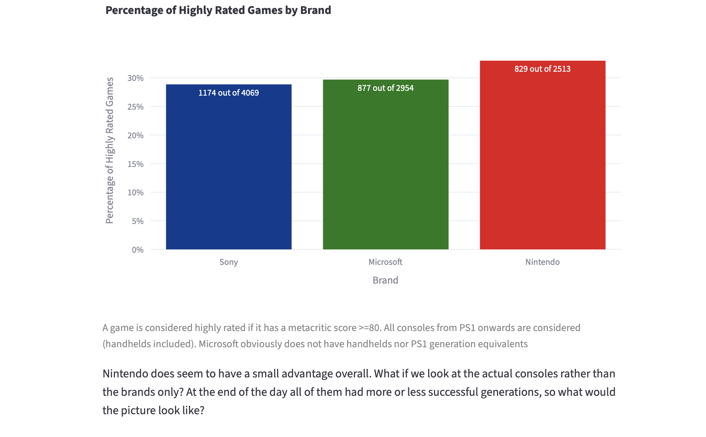
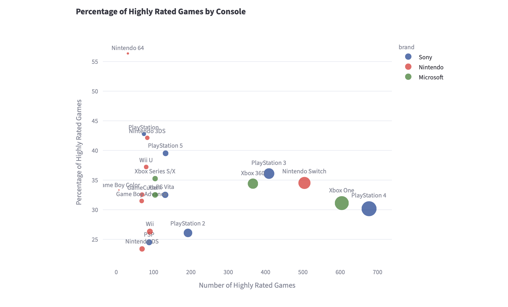
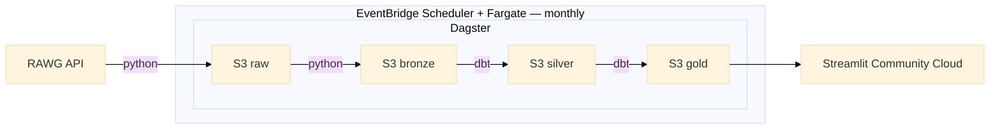

# Videogame quality analytics pipeline
[Dashboard](https://game-analytics-25bwptymfkeqwvtx6y5fyr.streamlit.app)



Aggregating by brand does not say much...



But aggregating by console does

FYI: Dashboard might be inactive, if so just press the button.

## What it does
- What it does: This repo handles an end-to-end data pipeline: it gets api data, models it and outputs it to a streamlit  dashboard. Data is updated monthly. 
- Why: I have been playing videogames for pretty much all my life. They carry a very emotional meaning and feelings that often intertwine with nostalgia. So I wanted to try to objectify things a bit and look at the data to see what games are actually good, if a platform owner has better games than another one 
- What it finds:Average metacritic score does not differentiate much. highly rated metacritic scores (80 and above) do and  high quality games, rather than being a feature of a producer specifically are more characteristics of a certain console


## Architecture


## Stack
Main objective that drove my decisions was this: have a production grade system, without unnecessary over-engineering, that costs as little as possible
- Cloud: AWS. All the pieces I needed in a single place, at very limited price for this use case, plus it's ubiquitous
- Compute: Fargate. To avoid complexity I opted for a serverless solution. I opted for Fargate rather than Lambda as the first is more suited to a batch job on a monthly basis (Lambda has the 15 minutes limit, more adapt to brief/frequent jobs)
- Storage: S3. I wanted to avoid having a persistent database, to avoid 24/7 costs and unnecessary overhead for this use case. Separating compute from storage allows different processes (Fargate pipeline, streamlit cloud) to read data without shared states.
- Engine: Duckdb. Quick, fast, flexible, in memory. For the volume this pipeline handles, Spark would have been an overkill
- Orchestrator: Dagster.  Modern orchestrator, assets based. I have preferred it to Airflow for these reasons. 
- Data transformation: dbt. Model testing, lineage, duckdb-integration, software practices applied to data.
- Containerization: Docker. Fargate executes containers. Easy reproducible builds with commit's hash.
- BI tool: Streamlit Community Cloud. Free hosting, no server to handle, easily integrates with s3 and duckdb
- Programming language: python

## Pipeline Design
The main objective of this pipeline is to ensure write idempotency and careful consideration has gone into this.
- Problem: Operations happen at month level and can generate multiple files (json from api, parquet from duckdb). Since s3 is not a database but an object storage. This means each object needs to be copied individually and x PutObject operations cannot be compounded into a single operation, meaning that each incomplete run could potentially leave data in an incoherent state. 
- Solution: write-then-promote. First writing into a staging area and then, only if operation is successful, delete pre-existing partition and move the new data into the partition. Hive partitioning (date=YYYY-MM) makes a month the working unit. Like this a single partition can be re-written without affecting others. Staging area covers raw and bronze. Silver and gold are deleted and rebuilt entirely at each run. This is the easiest idempotent solution because they are entirely derived from bronze, which is untouched.
- Guardrails: If there are no results from api, corresponding partition does not get deleted. Same thing happens with bronze partition.


## Operations
- Scheduling: EventBridge scheduler runs this cron job cron(00 00 15 * ? *) that triggers Fargate. Fixed revision of the task definition to keep image version specified. Secrets are handled via ParameterStore
- Alerting: SNS emails for unstarted containers or exit code != 0. No alerts for no new data (to avoid alert fatigue). ECS produces events, EventBridge filters them and pushes them to SNS. 
- Deployment: images pushed to ECR with consequential task revision of task definition.
- Finops: All resources are tagged to attribute resource costs specific to this project in Billing Console. Tagging propagated explicitly to Fargate instance via EventBridge. Monthly budget set up is 5 USD/month, monthly costs during development < 0.10 USD/month. No persistent service (apart from s3), nothing runs if not needed.
- Run: 

EventBridge->ECS Fargate (reads container from ECR + secret from ParameterStore)

```bash
aws ecs run-task \
  --cluster game-analytics-cluster \
  --task-definition game-analytics:<REVISION> \
  --launch-type FARGATE \
  --network-configuration 'awsvpcConfiguration={subnets=[<SUBNET_ID>],securityGroups=[<SECURITY_GROUP_ID>],assignPublicIp=ENABLED}' \
  --overrides '{"containerOverrides":[{"name":"game-analytics","environment":[{"name":"YEAR_MONTH","value":"2017-10"}]}]}' \
  --propagate-tags TASK_DEFINITION \
  --region eu-central-1 --no-cli-pager
```
The above commands require an existing AWS infrastructure, hence it's not reproducible as mentioned in the paragraph below.

## Limitations
This project currently has the following known limitations:
- Infrastructure: infrastructure was built via CLI and UI, not with IaC. This makes this part not version controlled nor reproducible. Due to the limited amount of resources involved and their stability I deemed using it not necessary.
- Data source: Rawg API data with metacritic score tends to become sparse in the recent years (e.g. October 2017: 30 games with score, June 2025 0 games with score) and update pattern is not clear (official docs don't say anything on the matter).On the other hand is the only API I could find that serves metacritic score without scraping directly from Metacritic. The pipeline is engineered to run a monthly job that downloads a 3 months-window data 24 months in the past to account for late arriving data. Due to the limitations mentioned above, on this interval is not yet producing new data (September 2026). Worth observing updating pattern and decide at a later stage whether to change source.
- Alerts: current alerting system does not cover cases when the job does not start in the first place (i.e. scheduler does not start). Detecting this failure would require an inverted logic (i.e. emitting signal at every run and flag its absence as a violation aka dead man's switch). This would need a custom metric at additional cost (~0.30 usd/month) that would still be sent after 30 days and I have decided to not do it.
- Storage: storage functions assume partitions below 1000 objects. This not addressed since current volume is way below this.

## Setup
Pre-requisites: 
- python 3.12
- poetry
- AWS account with s3 bucket + user with permissions `s3:GetObject`, `s3:PutObject`,`s3:DeleteObject` on bucket resources and permissions `s3:GetBucketLocation`,`s3:ListBucket` on the whole bucket

- Rawg API key
```bash
poetry install --with dev,pipeline
mkdir -p .dagster_home
cp dagster.yaml .dagster_home/
export DAGSTER_HOME="$(pwd)/.dagster_home"
cp .env.example .env
```
Open .env and input your values

## How to reproduce a run
Locally: 
```bash
ENV=local YEAR_MONTH=2017-10 poetry run dagster asset materialize \
  --select 'key:"raw_rawg_api" or key:"bronze_games" or key:"silver_and_gold_games"' \
  --module-name src.orchestration.definitions
```
Run should produce a parquet file with 30 records for 2017-10 (test value).
YEAR_MONTH specified in the command above overrides the 3 months windows (for testing purpose)

```bash
ENV=local poetry run python -c "import duckdb; print(duckdb.sql(\"SELECT count(*) FROM read_parquet('data/bronze/date=2017-10/*.parquet')\").fetchone()[0])"
```


